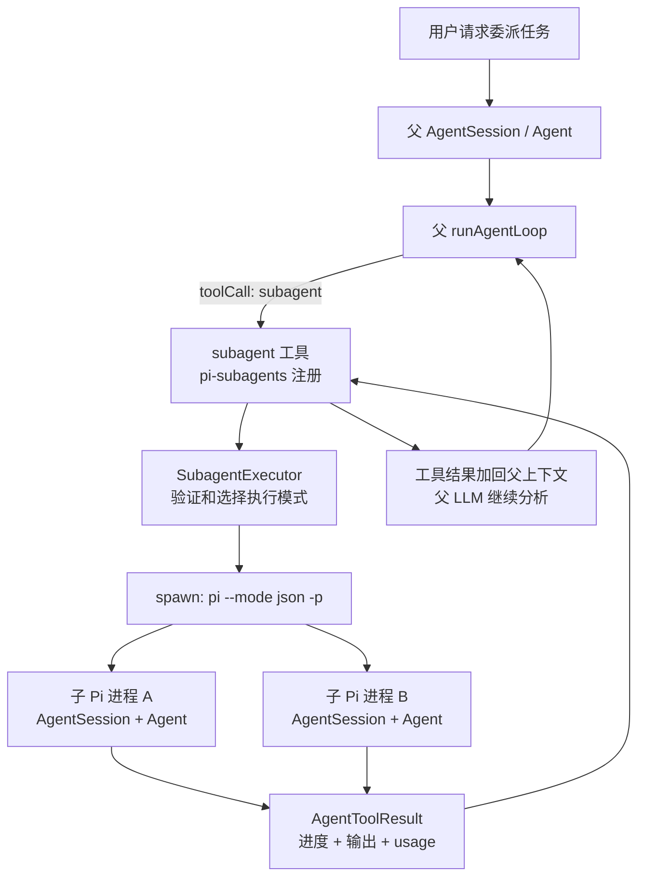
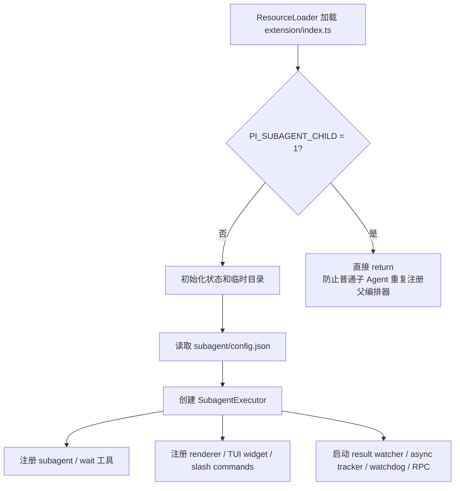
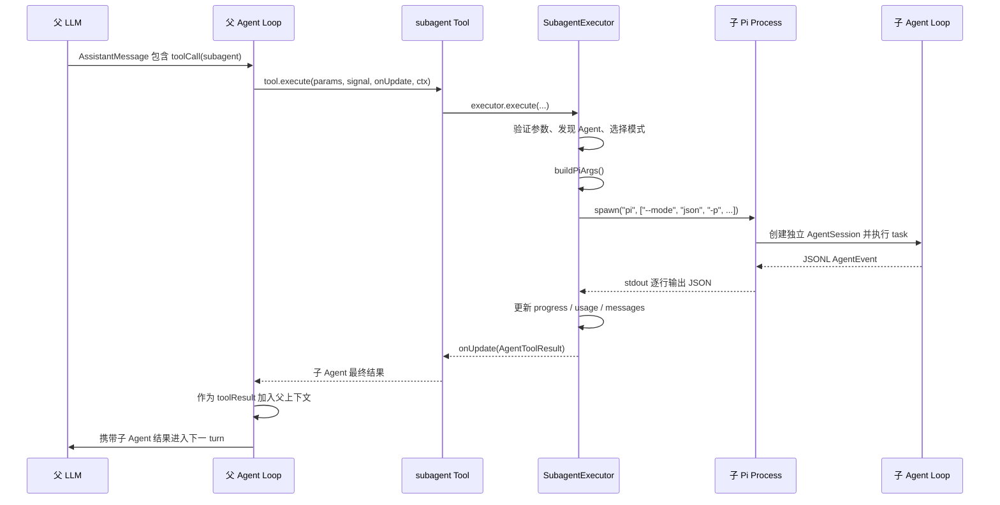

# pi-subagents 源码 Onboarding

> 适合读者：已经理解 Pi 的 `Agent` / `AgentSession` / `SessionManager` / 扩展机制，想继续学习多 Agent 编排。

## 1. 先用一句话理解它

`pi-subagents` 是一个 Pi 扩展：它向父 Pi 会话注册 `subagent` 工具，当父 Agent 调用该工具时，扩展会启动独立的子 Pi 进程/会话完成任务，再把子 Agent 的进度、工具事件和最终结果返回父会话。

它不是在同一个 `Agent` 对象里切换几个角色，而是：

```text
父 Pi Agent
  └─调用 subagent 工具
      ├─启动子 Pi 进程 A
      ├─启动子 Pi 进程 B
      └─收集子进程结果并返回父 Agent Loop
```

每个子进程里跑的仍然是完整的 Pi：`AgentSession -> Agent -> runAgentLoop() -> LLM / tools`。`pi-subagents` 新增的是上层的角色定义、进程启动、工作流编排、上下文分发、进度监控和结果回传。

## 2. 它和 Pi 主体的关系



| 层 | 负责内容 |
| --- | --- |
| Pi 主体 | LLM Provider、Agent Loop、工具执行、Session、JSON 模式事件输出 |
| `pi-subagents` | 角色、单任务/并行/链式编排、启动子 Pi、结果聚合、后台任务和进度 UI |
| Agent Markdown | 子 Agent 的 system prompt、工具、thinking、上下文策略 |

## 3. `pi install npm:pi-subagents` 做了什么

`pi install` 是 Pi 自己的包管理命令。用户级安装大致会：

1. 将 `npm:pi-subagents` 记录到 `~/.pi/agent/settings.json`。
2. 将 npm 包安装到 `~/.pi/agent/npm/` 管理的目录。
3. `ResourceLoader` / package manager 读取包的 `package.json#pi`。
4. 加载扩展、skill 和 prompt templates。

`pi install -l npm:pi-subagents` 则使用项目级 `.pi/settings.json` 和 `.pi/npm/`。

`package.json` 的关键清单是：

```json
{
  "pi": {
    "extensions": ["./src/extension/index.ts"],
    "skills": ["./skills"],
    "prompts": ["./prompts"]
  }
}
```

因此 Pi 会加载：

- `src/extension/index.ts`：运行时扩展入口。
- `skills/pi-subagents/SKILL.md`：告诉父 Agent 何时、如何委派。
- `prompts/*.md`：并行 review、research、handoff 等工作流模板。

### `install.mjs` 不是这条命令的主路径

`package.json#bin` 另外声明了 `pi-subagents -> install.mjs`。它是给 `npx pi-subagents` 这种独立安装方式使用的，会 clone GitHub 仓库到 `~/.pi/agent/extensions/subagent`。

```text
pi install npm:pi-subagents -> Pi package manager -> npm 包 + package.json#pi
npx pi-subagents            -> package.json#bin -> install.mjs -> git clone
```

## 4. 扩展启动时做了什么

入口是 `src/extension/index.ts` 的：

```ts
export default function registerSubagentExtension(pi: ExtensionAPI): void
```



递归防护是：

```ts
if (process.env[SUBAGENT_CHILD_ENV] === "1") return;
```

否则每个子 Pi 都会再次获得完整父编排能力，容易无限递归地启动子 Agent。只有被明确授予 `tools: subagent` 的 fanout child 才会加载限制版子编排入口，且受 `maxSubagentDepth` 限制。

## 5. Agent 角色定义与发现

内置角色位于 `agents/*.md`：

| Agent | 定位 |
| --- | --- |
| `scout` | 快速扫描代码和产出上下文 |
| `researcher` | 外部文档/网络调研 |
| `planner` | 根据上下文制定实施计划 |
| `worker` | 编辑代码并验证 |
| `reviewer` | 审查实现、测试和复杂度 |
| `context-builder` | 产出完整交接上下文 |
| `oracle` | 不编辑的第二意见/决策审查 |
| `delegate` | 轻量通用委派 |

一个 Agent Markdown 由 frontmatter 和 system prompt 组成，例如：

```yaml
---
name: scout
description: Fast codebase recon that returns compressed context for handoff
tools: read, grep, find, ls, bash, write, intercom
thinking: low
systemPromptMode: replace
inheritProjectContext: true
inheritSkills: false
output: context.md
defaultProgress: true
---
```

这些字段会变成子 Pi 的 model/thinking、tools、system prompt、项目上下文策略、输出文件和 session 策略。

Agent 定义的主要来源包括：

```text
/Users/andyyywang/Desktop/code/pi-subagents/agents/**/*.md     builtin
~/.pi/agent/agents/**/*.md               user
~/.agents/**/*.md                        user 兼容路径
.pi/agents/**/*.md                       project
.agents/**/*.md                          project 兼容路径
其他 Pi package 声明的 agent 目录
```

`src/agents/agents.ts` 的 `discoverAgents()` 负责加载、合并 overrides 并过滤 disabled Agent；项目定义优先于用户和内置定义。

## 6. 一次 `subagent` 调用的完整链路



`src/extension/schemas.ts` 用 TypeBox 定义 `SubagentParams`。执行器根据参数选择路由：

```text
agent + task -> single
tasks[]      -> parallel
chain[]      -> chain
action       -> management / status / control
async: true  -> background runner
```

`action` 是管理已有 Agent、chain 或 run，例如 list、status、stop、resume、steer、watchdog.configure，不是第四种任务模式。

## 7. 子 Pi 是如何启动的

`runSync()` 调用 `buildPiArgs()`，基本参数是：

```ts
baseArgs: ["--mode", "json", "-p"]
```

然后加入：

```text
--session / --no-session / --session-dir
--model provider/model:thinking
--tools read,grep,...
--extension subagent-prompt-runtime.ts
--system-prompt <temp-file>
Task: <task>
```

超过 8000 字符的 task 会写入临时文件，再以 `@file` 形式传给 Pi。最终调用：

```ts
spawn(spawnSpec.command, spawnSpec.args, {
  cwd,
  env: spawnEnv,
  stdio: ["ignore", "pipe", "pipe"]
})
```

`--mode json` 使子 Pi 将事件按 JSONL 输出。`src/runs/foreground/execution.ts` 的 `processLine()` 逐行处理：

- `tool_execution_start/end`：更新当前工具、路径和 tool count。
- `message_end`：收集完整消息、usage、turn count 和最终文本。
- final assistant stop：判断子任务是否正常完成。
- `onUpdate`：将快照推给父 Pi 的 tool UI。

## 8. 三种工作流模式

### 8.1 Single

```ts
subagent({
  agent: "oracle",
  task: "Challenge the current implementation plan."
})
```

一个角色、一个子 Pi 进程、一份结果。适合 review、scout 或第二意见。

### 8.2 Parallel

```ts
subagent({
  tasks: [
    { agent: "reviewer", task: "Review correctness" },
    { agent: "reviewer", task: "Review tests" },
    { agent: "reviewer", task: "Review complexity" }
  ],
  concurrency: 3
})
```

`mapConcurrent()` 使用 Promise worker pool 执行多个任务，并可通过 `Semaphore` 限制全局并发数。结果按原任务顺序聚合，而不是按完成先后乱序返回。

并行 writer 可以启用 `worktree: true` 将每个任务放入独立 Git worktree。它解决代码写入冲突，不是 OS 权限隔离。

### 8.3 Chain

```ts
subagent({
  chain: [
    { agent: "scout", task: "Inspect the auth flow" },
    { agent: "planner", task: "Create a plan from: {previous}" },
    { agent: "worker", task: "Implement the approved plan: {previous}" }
  ]
})
```

Chain 按顺序执行 step，前一步输出可通过 `{previous}` 注入下一步。命名输出还可通过 `{outputs.name}` 精确引用。Chain 的 step 也可以是 parallel group，因此可表达：

```text
并行收集上下文
  -> 单 planner 汇总
  -> 单 worker 实现
  -> 并行 reviewer 验证
```

## 9. Foreground 与 Async

### 9.1 Foreground

Foreground 由当前 `subagent` tool call 直接等待子进程：

```text
父 Agent toolCall
  -> spawn child
  -> stdout JSONL
  -> onUpdate 刷新 tool UI
  -> child exit
  -> subagent toolResult
```

父 Agent Loop 必须等工具返回后才能进入下一 turn。

### 9.2 Async / Background

`async: true` 时，扩展生成运行配置和状态目录，再启动独立 background runner。`subagent` 工具较快返回 run id，父 Agent 可继续做其他工作。

```text
subagent(async: true)
  -> 返回 run id
  -> background runner 执行 children
  -> status.json / events.jsonl 持续更新
  -> result watcher 发现完成
  -> Pi event + TUI 通知
  -> 父 Agent 通过 wait/status 获取结果
```

`wait` 工具不是 sleep/polling，而是当父 turn 必须等待时，阻塞到某个或全部后台 run 完成/需要人工关注。

## 10. 上下文与记忆

### 10.1 Fresh context

`context: "fresh"` 不复制父会话历史。子 Agent 主要得到：

- 它自己的 system prompt。
- 父编排器显式传入的 task。
- 根据 Agent 配置决定是否继承项目 context files / skills。
- 指定的 reads 和产物文件。

它适合需要独立视角的 reviewer，可减少父 Agent 已有结论对审查的污染。

### 10.2 Fork context

`context: "fork"` 会通过父 `SessionManager` 的当前 leaf 创建 branched session JSONL，然后以 `--session <forked-file>` 启动子 Pi。

```text
父 Session JSONL 当前分支
  -> SessionManager.createBranchedSession(leafId)
  -> 子 Session JSONL
  -> 子 Agent 恢复父分支的有效历史
  -> 在子分支上继续对话
```

它适合 oracle 或 worker 需要理解父会话决策历史的场景，代价是 Token 更多，也可能传入无关历史。

### 10.3 角色级持久记忆

自定义 Agent 还可声明：

```yaml
memory:
  scope: project
  path: security-reviewer
```

`agent-memory.ts` 会安全解析路径，从对应 `agent-memory/.../MEMORY.md` 读取最多 200 行/16 KiB，注入子 Agent system prompt。有写工具的 Agent 可追加可复用角色知识；只读 Agent 只能消费已有记忆。

| 机制 | 作用 |
| --- | --- |
| fresh/fork session | 决定某次子任务获得哪些对话历史 |
| Agent `MEMORY.md` | 跨多次运行保存某个角色的精简、可复用经验 |
| chain `{previous}` | 同一工作流中的显式步骤交接 |

## 11. 子进程通信

| 通道 | 用途 |
| --- | --- |
| 子 Pi stdout JSONL | Foreground 实时消息、工具事件、usage |
| `status.json` | Background run 的当前状态快照 |
| `events.jsonl` | Background run 生命周期事件 |
| result JSON | 后台完成结果，由 result watcher 发现 |
| `pi.events` | 同一父 Pi 进程内的 start/complete/RPC 通知 |
| control inbox | stop / interrupt / steer / resume 控制 |
| supervisor channel / intercom | 子 Agent 需要决策时联系父编排器 |

`pi.events` 只在当前进程内有效，不能直接跨越子 Pi 进程，所以 background 和跨进程控制还需要文件和专用通道。

## 12. 运行产物与可观测性

Foreground 运行可产生：

```text
<run>_input.md
<run>_output.md
<run>.jsonl
<run>_transcript.jsonl
<run>_meta.json
```

Async run 主要产生：

```text
status.json       当前状态
events.jsonl      生命周期日志
output-<n>.log    子任务输出
subagent-log-*.md 可读日志
result JSON       最终结果
```

临时根目录默认在 OS temp 下的 `pi-subagents-<scope>`，包含 `async-subagent-runs/`、`async-subagent-results/`、`chain-runs/` 和 `artifacts/`。项目级持久产物可位于 `.pi-subagents/`。

这些机器可读文件是状态查询、故障恢复和外部集成的基础，不建议通过抓取 TUI 文本获取状态。

## 13. 安全、隔离和限制

### 13.1 它不是 Sandbox

子 Pi 是 `child_process.spawn()` 启动的普通进程，默认继承父进程环境和当前用户权限。它能做什么主要由分配的 Pi tools 决定，不是由 OS 容器/沙箱限制。

`worktree: true` 只是让并行 writer 在不同 Git worktree 中修改代码，子进程仍可能访问工作树外的文件。

### 13.2 应用层保护

- `PI_SUBAGENT_CHILD` 防止普通子 Agent 递归启动。
- `maxSubagentDepth` 限制 fanout child 的嵌套深度。
- `turnBudget` 先要求收尾，超过 grace 后中止。
- `toolBudget` 在软阈值提醒，硬阈值后阻断指定工具。
- timeout / AbortSignal / stop / interrupt 控制子进程。
- model scope 可限制允许的 Provider/Model。
- memory 路径校验防止 `..` 或 symlink 逃出根目录。

这些是应用层管理，不能替代真正的文件系统、网络和进程权限沙箱。Pi 官方包文档也明确提醒：第三方扩展代码具有完整系统访问能力，安装前应审查源码。

## 14. 主要模块地图

| 文件 | 职责 |
| --- | --- |
| `src/extension/index.ts` | composition root；注册 tools、UI、events、slash、watcher |
| `src/extension/schemas.ts` | `subagent` / `wait` 的 TypeBox 契约 |
| `src/runs/foreground/subagent-executor.ts` | 总路由器；验证、发现 Agent、选 single/parallel/chain/async |
| `src/runs/foreground/execution.ts` | 启动 foreground 子 Pi，解析 stdout JSONL |
| `src/runs/foreground/chain-execution.ts` | 前台 chain 执行和步骤交接 |
| `src/runs/background/async-execution.ts` | 构造后台 run 配置并启动 runner |
| `src/runs/background/subagent-runner.ts` | 执行后台 steps 并写状态/事件 |
| `src/runs/background/async-job-tracker.ts` | 父 Pi 进程内的后台 job 状态 |
| `src/runs/background/result-watcher.ts` | 监视后台结果并通知父会话 |
| `src/runs/shared/pi-args.ts` | 生成子 Pi CLI 参数和环境变量 |
| `src/runs/shared/parallel-utils.ts` | Promise worker pool、Semaphore、结果聚合 |
| `src/shared/fork-context.ts` | 从父 SessionManager 生成子分支 Session |
| `src/agents/agents.ts` | Agent Markdown 发现、解析、优先级和 overrides |
| `src/agents/agent-memory.ts` | 角色级 `MEMORY.md` 记忆注入 |
| `src/runs/shared/subagent-prompt-runtime.ts` | 子 Pi runtime；上下文裁剪、边界 prompt、steer、budget |
| `src/slash/*` | `/run`、`/chain`、`/parallel` 等人类交互封装 |
| `src/tui/*` | 工具进度、后台 widget 和结果渲染 |
| `src/intercom/*` | 父子 Agent 决策协调与结果投递 |
| `src/watchdog/*` | 改动检测、LSP 诊断和对抗式 review |

## 15. 推荐阅读顺序

### 第一轮：主链路

1. `package.json`
2. `src/extension/index.ts`
3. `src/extension/schemas.ts`
4. `src/runs/foreground/subagent-executor.ts`
5. `src/runs/foreground/execution.ts`
6. `src/runs/shared/pi-args.ts`

### 第二轮：编排与上下文

1. `src/runs/foreground/chain-execution.ts`
2. `src/runs/shared/parallel-utils.ts`
3. `src/runs/shared/chain-outputs.ts`
4. `src/runs/shared/workflow-graph.ts`
5. `src/shared/fork-context.ts`

### 第三轮：后台系统

1. `src/runs/background/async-execution.ts`
2. `src/runs/background/subagent-runner.ts`
3. `src/runs/background/async-job-tracker.ts`
4. `src/runs/background/result-watcher.ts`
5. `src/runs/background/control-channel.ts`
6. `src/runs/background/run-status.ts`

### 第四轮：增强功能

1. `src/agents/agent-memory.ts`
2. `src/intercom/*`
3. `src/watchdog/*`
4. `src/runs/shared/acceptance.ts`
5. `src/runs/shared/structured-output.ts`
6. `src/runs/shared/model-fallback.ts`

## 16. 学完后应该能回答

1. `pi install npm:pi-subagents` 为什么能自动找到 `extension/index.ts`？
2. 为什么说子 Agent 是独立 Pi 会话，而不是父 `Agent` 内部的一个函数？
3. `PI_SUBAGENT_CHILD` 解决了什么问题？
4. `--mode json` 为什么是父扩展监控子 Agent 的关键？
5. single、parallel、chain 的输入输出有什么不同？
6. foreground 和 async 的生命周期由谁持有？
7. fresh、fork、`MEMORY.md` 和 `{previous}` 分别解决什么问题？
8. `pi.events` 为什么不足以完成所有父子通信？
9. worktree 为什么不是 sandbox？
10. 子 Agent 输出最终如何变成父 Agent 下一 turn 的上下文？

## 17. 最简心智模型

```text
Pi package manifest
  -> 加载 extension + skill + prompts

父 LLM 选择调用 subagent
  -> SubagentExecutor 选择 single / parallel / chain / async
  -> discoverAgents 读角色 Markdown
  -> buildPiArgs 构造独立子 Pi 命令
  -> spawn("pi --mode json -p ...")
  -> 子 Agent 使用普通 Pi Agent Loop 完成任务
  -> 父扩展解析 JSONL 事件/后台产物
  -> 聚合为 subagent toolResult
  -> 父 LLM 继续推理和最终回答
```

最重要的是理解三条边界：

1. **Pi 核心与扩展编排的边界**：子 Agent 仍然使用 Pi Agent Loop。
2. **父会话与子会话的边界**：上下文通过 fresh/fork/task/artifact 显式传递。
3. **逻辑编排与安全隔离的边界**：budget、depth 和 worktree 都不等于 OS sandbox。
